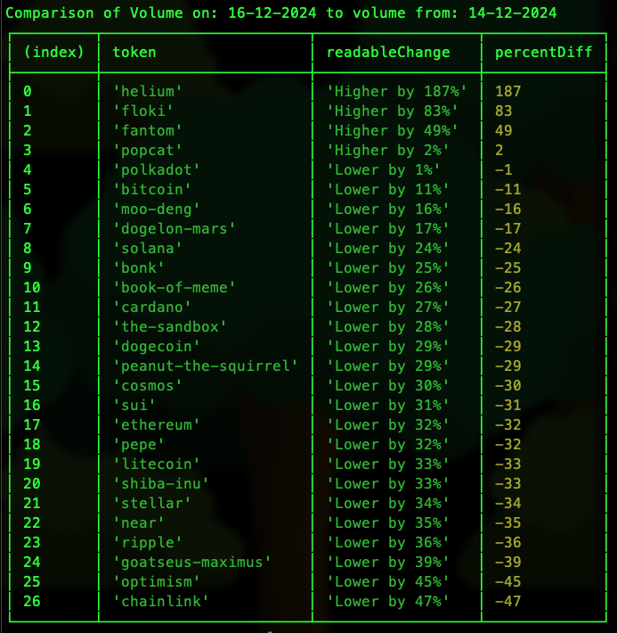

# Volume Change Ranker

A little script that gets volume data from [CoinGecko](coingecko.com) and ranks by the _change_ in volume.

<br/>

## Edit Config

Updates the variables in `src/config.ts` to recent dates and the tokens you would like it to scan.

<br/>

## Run It

Use a node version at least v20:
```
nvm use v20
```

Then install dependencies:
```
npm i
```

Then run the start command:
```
npm start
```

The script waits about 15 seconds between api calls in order to avoid getting rate limited by coingecko. 😅

When it's finished it sould print out a table in the console that looks something like this:


